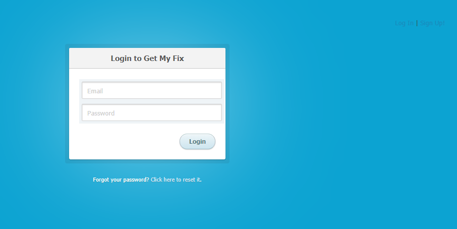

# Get Your Fix [Link](https://calm-woodland-24600.herokuapp.com/)
    
## Description
    The project is an application that allows a user to login, input medication information, and set up reminders.  The purpose is to provide a tool to assist the user in following and maintaining a prescribed medications regimen.

## Table of Contents
    - [Installation](#installation)
    - [Usage](#usage)
    - [License](#license)
    - [Tests](#tests)
    - [Contributors](#contributors)

## Installation
Packages required to run this program are: 

bcrypt
connect-session-sequelize
node-schedule
dotenv
express
express-handlebars
express-session
handlebars
mysql
mysql2
nodemailer
sequelize

## Usage
Examples of how to use this program: 

A user sets up a profile or logs in from the Login/New User page.  The user is then taken to a form that is used to fill in medication-related information.  This information can include the medication name, prescribed dosage and times, length of regimen, refill information, any known side-effects, etc., and is then placed into a database that can only be accessed by the user.

The medications and their details are displayed for easy reference on the user's profile page.  An option to set up an email reminder is available.  Using Nodemailer, an email is sent to the user with a reminder for dosage times, medication refills, etc, controlling the timing of the emails is the node schedule package.

## Screenshots

## License
MIT

## Tests
To test, run the following command:
no test

## Contributors
Joe Malone,
D.L. White,
Ivan Zabrodin,
Corey Colbert

## Contact

 

View the project in GitHub at: ---.
